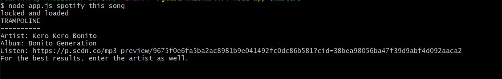

# liri-node-app 
# This app is designed to let you gather information and program distraction free. 

Programmers do their best work in focused, exclusive time blocks free from any disruption. 

Eventually, however, every programmer is going to come up against a problem they can't solve without going online to research.

This wouldn't be so bad, were it not for the fact that every institution on the internet is waging a war for human attention, and their weapons are lethal. No matter how strong your will is, eventually you will succumb to your temptations and the attention holes will claim you, breaking whatever flow state you had and robbing you of your time. 

This app is designed to free you from that cycle. 

While it's but a seed now, in it's full, flourishing form, this will let programmers research whatever problems they may have and 
pull the information straight to the terminal, without any of the perils of swimming in the information sea. 

Check out the video below to see how it works!

The app also has the functionality to handle empty requests, which will pull from a preset search request. 

